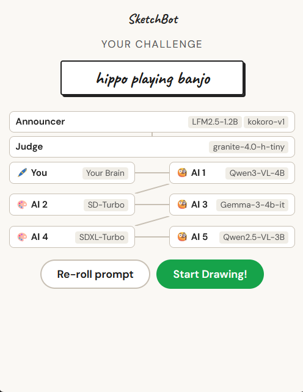
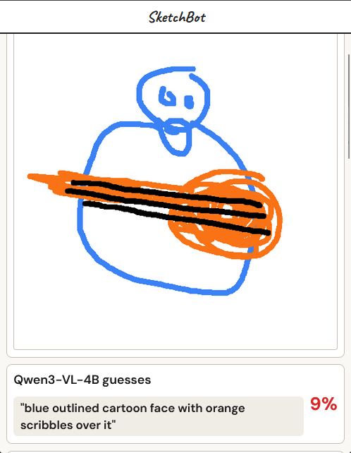
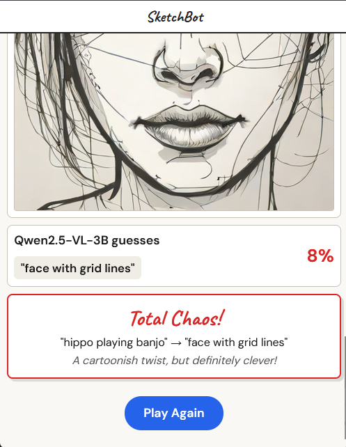

# SketchBot

SketchBot is a game of telephone pictionary with 100% local AI! The player receives a prompt and draws it, then a vision AI guesses what it is, the guess becomes the prompt for an image generation AI, and so on! 

Delightfully narrated by an LLM with a synthetic voice and judged by yet another LLM.

| Prompt | Drawing | Finale |
|--------|---------|--------|
|  |  |  |

## Setup

1. Download and install [Lemonade Server](https://github.com/lemonade-sdk/lemonade)
2. Start Lemoande Server with `lemonade-server serve --max-loaded-models 5`
3. Download sketchbot.html and open it in your browser

## Implementation

The game itself is a single HTML/CSS/JS file. It relies on Lemonade Server to run all AI capabilities locally.

## License

This project is available under the [MIT license](./LICENSE).